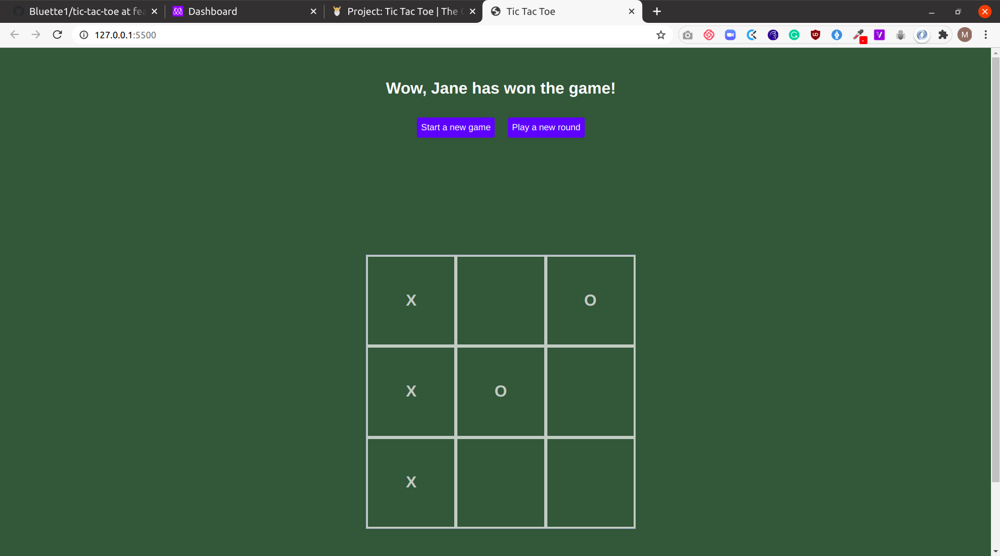

# Library app

## Project description
This project is an implementation of the tic-tac-toe game.

This project was done for learning purpose, the aim was to master objects, objects constructors and factories in javascript. The project's specifications are listed on [The odin project](https://www.theodinproject.com/courses/javascript/lessons/tic-tac-toe-javascript)

## Screenshot

## Built with
- HTML5
- CSS3
- Vanilla Javascript

## Features
- User can start a new game
- User see who the winner of the game is
- If there is no winner, a draw is indicated
- User can play as many games as they want

## Deployment
[TicTacToe app on netlify](https://eloquent-hopper-9cff17.netlify.app)

## Running and testing it locally

### Prerequisites
No special pre-requisite required for this project

### Setup
- Run `git clone https://github.com/bluette1/tic-tac-toe && cd tic-tac-toe` to get a copy of source codes on your local computer and to navigate inside the project directory

### Usage
- If you have a live-server installed on you computer, you can open `index.html` file with that server, or simply open `index.html` file with your favorite browser

### Game Instructions
- For details about the tic tac toe game, read [here](https://en.wikipedia.org/wiki/Tic-tac-toe).
- Click `Start New Game`
- Enter the player's names
- Play by adding an `X` or `O` mark on the board until there's a winner(i.e there exists a row, column or diagonal that is filled with the same mark.
- The winner is declared, and the user can start a new game by clicking on the `Play Again` button.

### Tests
- No test yet

## Contributions

There are two ways of contributing to this project:

1.  If you see something wrong or not working, please check [the issue tracker section](https://github.com/bluette1/tic-tac-toe/issues ), if that problem you met is not in already opened issues then open a new issue by clicking on `new issue` button.

2.  If you have a solution to that, and you are willing to work on it, follow the below steps to contribute:
    1.  Fork this repository
    1.  Clone it on your local computer by running `git clone https://github.com/your-username/tic-tac-toe.git` __Replace *your username* with the username you use on github__
    1.  Open the cloned repository which appears as a folder on your local computer with your favorite code editor
    1.  Create a separate branch off the *master branch*,
    1.  Write your codes which fix the issue you found
    1.  Commit and push the branch you created
    1.  Raise a pull request, comparing your new created branch with our original master branch [here](https://github.com/bluette1/tic-tac-toe)

## Author

👤 **Mugirase Emmanuel**

- Github: [@descholar-ceo](https://github.com/descholar-ceo)
- Twitter: [@descholar3](https://twitter.com/descholar3)
- Linkedin: [MUGIRASE Emmanuel](https://www.linkedin.com/in/mugirase-emmanuel)

👤 **Marylene Sawyer**
- Github: [@Bluette1](https://github.com/Bluette1)
- Twitter: [@MaryleneSawyer](https://twitter.com/MaryleneSawyer)
- Linkedin: [Marylene Sawyer](https://www.linkedin.com/in/marylene-sawyer)

## Show your support

Give a ⭐️ if you like this project!

## Acknowledgment
* [Microverse](https://www.microvese.org)
